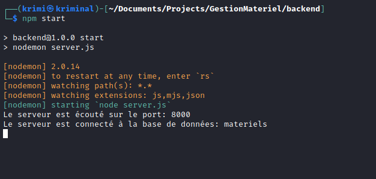

## Application gestion des matériels coté serveur

### 🚀 React / Express / MongoDB / GraphQL 🚀

- Install these program in your PC
  - MongoDB
  - Node.js
  - `npm install -g nodemon` (if you don't have installed)

---

- Open a terminal inside the project folder :
    
  - Install all backend's packages : `cd backend` + `npm install`

    - then start backend server : `npm start`

---

### Backend config :

- Create `.env` file inside the backend folder within the following data
  - PORT=8000 `your localhost port`
  - ORIGIN=http://localhost:3000 `your client url`
  - MONGO_URI=mongodb://localhost:27017/materiels `your mongo db uri`
  - TOKEN_SECRET=990bf68e6adf1be5f1671bba3bec692056922454 `your random secret key`

💻 Made by Fanomezantsoa Herifiandry Marc Nico, 12 novembre 2021 at 14h 34min. Free to use

Email: ny.kalash@gmail.com

Facebook: Ks Krimi

site web: ks-krimi.github.io

Tel: 032 40 519 20 / 034 82 419 97
